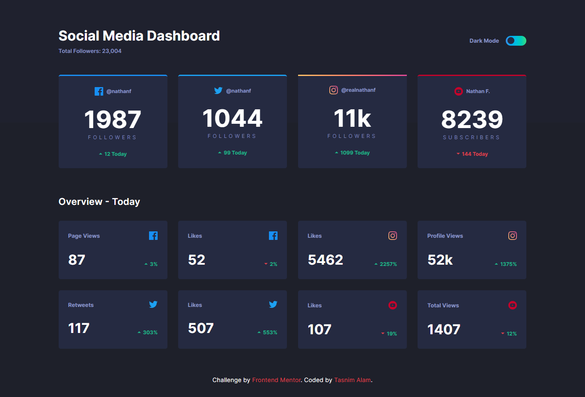
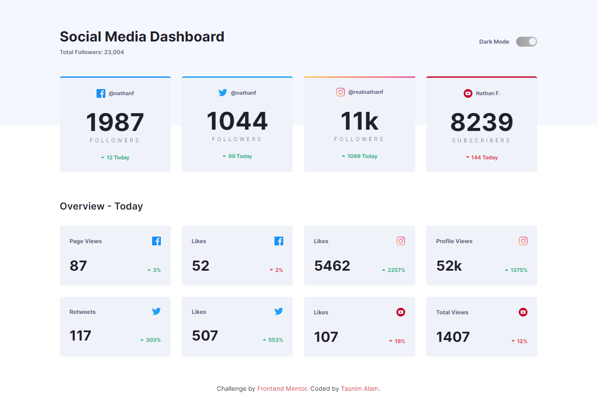

# Frontend Mentor - Social media dashboard with theme switcher 

This is a solution to the [Social media dashboard with theme switcher challenge on Frontend Mentor](https://www.frontendmentor.io/challenges/social-media-dashboard-with-theme-switcher-6oY8ozp_H). Frontend Mentor challenges help you improve your coding skills by building realistic projects. 

## Table of contents

- [Overview](#overview)
  - [The challenge](#the-challenge)
  - [Screenshot](#screenshot)
  - [Links](#links)
- [My process](#my-process)
  - [Built with](#built-with)
  - [What I learned](#what-i-learned)
- [Author](#author)


## Overview


### The challenge

Users should be able to:

- View the optimal layout for the site depending on their device's screen size
- See hover states for all interactive elements on the page
- Toggle color theme to their preference

### Screenshot





### Links

- Solution URL: [Repository](https://github.com/Tasnim005/Social-media-dashboard-with-theme-switcher)
- Live Site URL: [Live preview](https://tasnim005.github.io/Social-media-dashboard-with-theme-switcher/)

## My process

### Built with

- Semantic HTML5 markup
- Flexbox
- CSS Grid

### What I learned

```js
const theme = document.querySelector('.theme');
const circle = document.querySelector('.circle');
theme.addEventListener('click', themeChange);

function themeChange() {
  circle.classList.toggle('clicked');
  document.body.classList.toggle('lightTheme')

}
```

## Author
- Website - [Tasnim Alam](https://github.com/Tasnim005)
- Frontend Mentor - [Tasnim005](https://www.frontendmentor.io/profile/Tasnim005)


